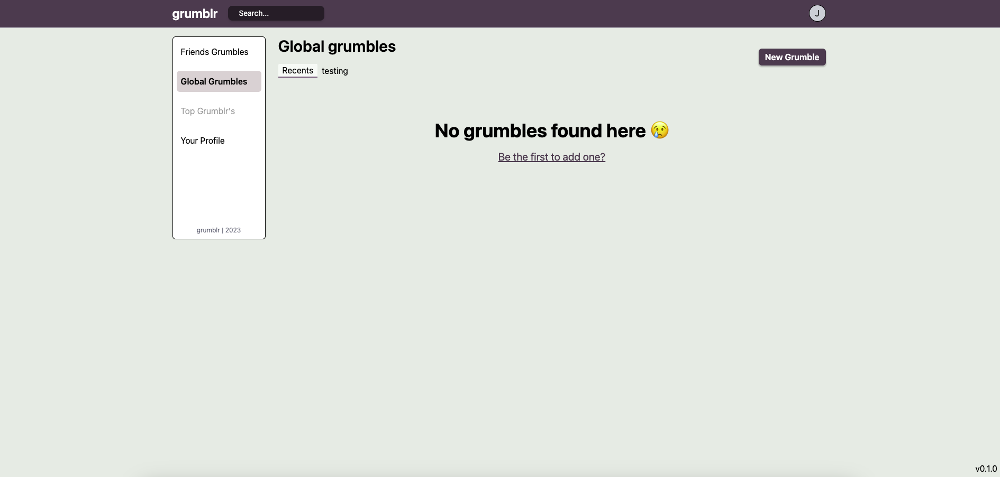
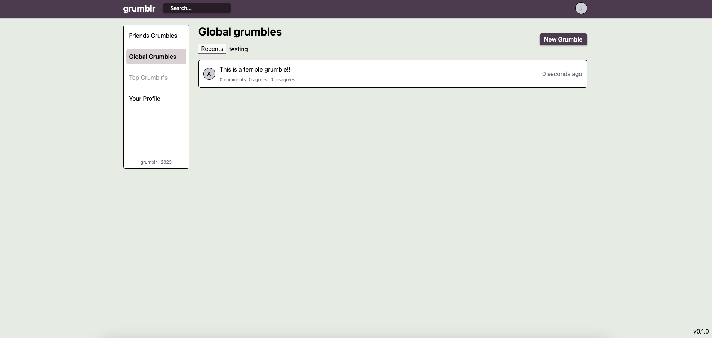
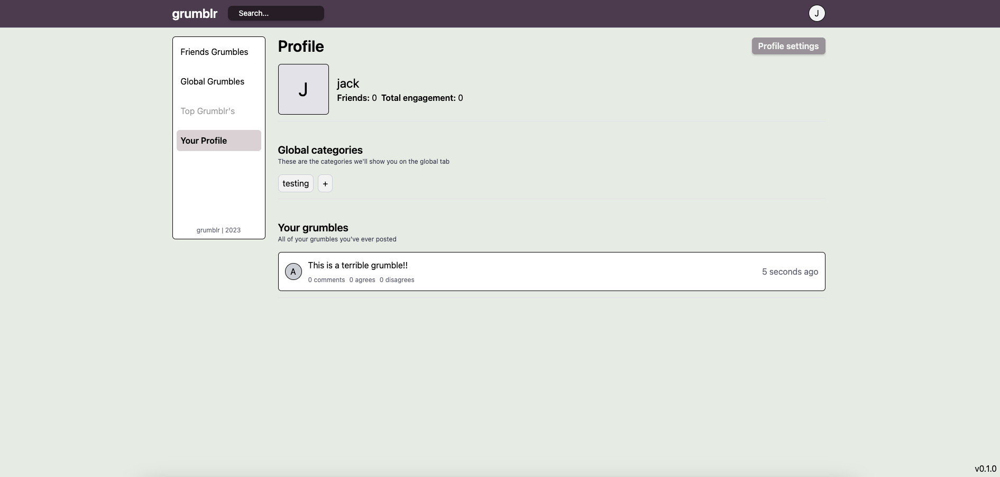
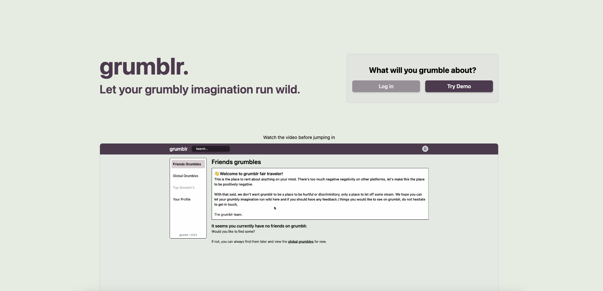

# grumblr
### `grumlbr` is the platform you need to take away any unwanted stress you may have. This is the place to move all negative things away from other social media sites and concentrate them in one place.





## Running `grumblr` locally

We use Docker for our builds, makes it nice and easy to run multiple services at once and have our prod the same as our dev.

1) ```
   git clone https://github.com/JackElli/grumblr.git
   cd grumblr
   cp .env.example .env
   docker network create grumblr_default
    ```

2) Run docker and do
    ```
    docker-compose up dev --build -d
    ```

3) Not everything will work right away, we need to set up our Couchbase database. Log in to your database at `localhost:8091`, set up a cluster, and give username `Administrator` and password `password`.

4) Then create the bucket `grumblr` and scope `dev` with 3 collections in the dev scope `grumbles`, `categories` and `users`.

5) Go to `localhost:5173` and you should see the following, (if not, restart your grumblrapi container)


6) Remember, this is local, so you can break it and nothing will happen to grumblr.

7) To make grumblr functional, we need to add some indexes. Go to the query tab in couchbase and run the following queries:
    ```
   CREATE PRIMARY INDEX `#primary` ON `grumblr`.`dev`.`categories`;

   CREATE PRIMARY INDEX `#primary` ON `grumblr`.`dev`.`grumbles`;

   CREATE PRIMARY INDEX `#primary` ON `grumblr`.`dev`.`users`;

   CREATE INDEX `grumbleUsers` ON `grumblr`.`dev`.`users`(`id`);
    ```

8) Once we have the indexes, we should be able to use grumblr as normal.

9) Cookies will be saved for grumblr for authentication purposes, it will store a JWT every time you log in. This JWT makes sure that you have access to grumblr. You can view this in the `application` tab under `token` in the developer tools on your browser.

## Any changes are welcome!
Quite a few features haven't been implemented yet, but we've added the barebones front end framework to show how it will look once they are implemented.

